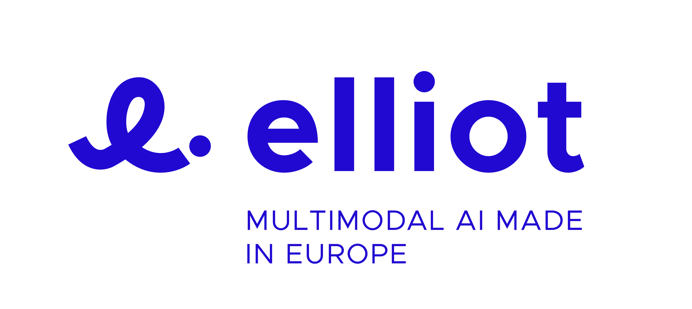

<div align=center><div align=left>

# Visual Bias Mitigator (VB-Mitigator)
[](https://mammoth-eu.github.io/mammoth-commons/index.html)

This software is part of MAI-BIAS; a low-code toolkit for
fairness analysis and mitigation, with an accompanying suite of coding
tools. Our ecosystem operates in multidimensional and multi-attribute
settings (safeguarding multiple races, genders, etc), and across multiple
data modalities (like tabular data, images, text, graphs). Learn more
[here](https://mammoth-eu.github.io/mammoth-commons/index.html).

---

<!--The Visual Bias Mitigator is an open-source framework designed to empower researchers in the field of bias mitigation in  computer vision. This codebase provides a comprehensive environment where users can easily implement, run, and evaluate existing visual bias mitigation methods.

With the increasing awareness of bias in AI systems, it is crucial for researchers to have access to robust tools that facilitate the exploration and development of mitigation approaches. The Visual Bias Mitigator (VB-Mitigator) serves this purpose by offering:

- 🚀 **Implemented Methods**: A collection of established visual bias mitigation methods that can be directly utilized, allowing researchers to replicate and understand their functionality.
- 🔧 **Extensibility**: Researchers can exploit this code-base to develop custom bias mitigation approaches tailored to their specific needs. The framework is designed with flexibility in mind, enabling easy integration of new approaches.
- 📊 **Performance Comparison**: The framework facilitates the performance comparison between custom methods and state-of-the-art. 

The aim of this repository is to facilitate research in the domain of visual bias mitigation. By providing a comprehensive codebase that allows researchers to easily implement and build upon existing methodologies, we encourage the development of new approaches for addressing biases in computer vision tasks.--> 


## 🌍 Overview
**VB-Mitigator** is an open-source **platform for evaluating, comparing, and developing visual bias mitigation methods** in computer vision.  

It empowers researchers, engineers, and industry teams to **build fairer AI systems**, benchmark state-of-the-art approaches, and innovate new strategies to address bias in real-world models.

The framework provides:

- 🚀 **Pre-implemented Methods**: Use or replicate established bias mitigation approaches like BAdd, MAVias, and FLAC  
- 🔧 **Extensibility**: Integrate custom methods or datasets with minimal effort  
- 📊 **Performance Comparison**: Evaluate your approach against baselines across multiple datasets and metrics  

VB-Mitigator is designed to **bridge research and real-world deployment**, making it easy to explore and reduce bias in computer vision systems.

---

## 🎯 Who is this for?
- **AI researchers** exploring bias mitigation and fairness  
- **ML engineers** building attribute classification, face recognition, or other CV pipelines  

---

## 💡 Why VB-Mitigator matters
- ✅ **Accelerates research** by providing a ready-to-use framework  
- ✅ **Supports reproducibility** with prebuilt methods and datasets  
- ✅ **Flexible platform** for both experimentation and benchmarking  

---

## 🔥 Key Features
- Collection of **state-of-the-art bias mitigation methods**  
- **Easy-to-extend codebase** for custom approaches  
- **Dataset-agnostic** evaluation pipeline  
- **Standardized metrics and logs** for fair comparison  
- Supports **rapid prototyping and reproducibility**  

---

## ⚡ Quick Start

Get started with Visual Bias Mitigator quickly:

### 1. Clone the Git Repository

```bash
git clone https://github.com/gsarridis/vb-mitigator.git
```

### 2. Create a Virtual Environment and Install Required Packages

You can use either `pip` or `conda` to create a virtual environment and install dependencies:

```bash
# create a virtual conda environment
conda create -n vb-mitigator python=3.11

# activate the environment
conda activate vb-mitigator

# install the required packages
pip install -r requirements.txt
```

### 3. Run a Sample Script

```bash
# run BAdd method on UTKFace dataset
bash ./scripts/utkface/badd/badd.sh
```

### 4. Check Logs for Results and Metrics  

The output is stored in the `outputs/utkface_baselines/badd` directory.

#### **Output Structure:**

```
├── outputs
│   ├── utkface_baselines
│   │   ├── badd
│   │   │   ├── logs.csv
│   │   │   ├── out.log
│   │   │   ├── best.pth
│   │   │   ├── latest.pth
│   │   │   └── train.events
```

## 📖 Documentation
You can find the complete documentation for VB-Mitigator [here](https://vb-mitigator.readthedocs.io/).


## 📖 Citations

```
@article{sarridis2025vb,
  title={Vb-mitigator: An open-source framework for evaluating and advancing visual bias mitigation},
  author={Sarridis, Ioannis and Koutlis, Christos and Papadopoulos, Symeon and Diou, Christos},
  journal={arXiv preprint arXiv:2507.18348},
  year={2025}
}

@article{sarridis2024flac,
  title={Flac: Fairness-aware representation learning by suppressing attribute-class associations},
  author={Sarridis, Ioannis and Koutlis, Christos and Papadopoulos, Symeon and Diou, Christos},
  journal={IEEE Transactions on Pattern Analysis and Machine Intelligence},
  year={2024},
  publisher={IEEE}
}

@article{sarridis2024badd,
  title={BAdd: Bias Mitigation through Bias Addition},
  author={Sarridis, Ioannis and Koutlis, Christos and Papadopoulos, Symeon and Diou, Christos},
  journal={arXiv preprint arXiv:2408.11439},
  year={2024}
}

@article{sarridis2024mavias,
  title={MAVias: Mitigate any Visual Bias},
  author={Sarridis, Ioannis and Koutlis, Christos and Papadopoulos, Symeon and Diou, Christos},
  journal={arXiv preprint arXiv:2412.06632},
  year={2024}
}
```

**Maintainer:** Ioannis Sarridis (gsarridis@iti.gr)<br>

## 🙏 Acknowledgments
This research was supported by the EU Horizon Europe projects MAMMOth
(grant no. 101070285), ELIAS (grant no. 101120237), and ELLIOT (grant no. 101214398).
<div align="center">   </div>
